<table border=1 width=100%>
<tr>
    <th align="left">EXERCISE 1</th>
    <th align="center">OUTPUT</th>
</tr>
<tr>
    <td>List all the records in the payments table. Display only the first 10 rows of results.</td>
    <td></td>
</tr>
<tr>
<td colspan=2>
<details>
<summary>Click here to see the answer</summary>

```py
query = Payment.objects.all()
query = query[0:10]
query = query.values()
df = DataFrame(data=query)
```
</details>
</td>
</tr>
</table>
    
<table border=1 width=100%>
<tr>
    <th align="left">EXERCISE 2</th>
    <th align="center">OUTPUT</th>
</tr>
<tr>
    <td>Display all the values for check_number in the payments table.</td>
    <td></td>
</tr>
<tr>
<td colspan=2>
<details>
<summary>Click here to see the answer</summary>

```py
query = Payment.objects.all()[0:10]
query = query.values('check_number')
df = DataFrame(data=query)
```
</details>
</td>
</tr>
</table>
    
<table border=1 width=100%>
<tr>
    <th align="left">EXERCISE 3</th>
    <th align="center">OUTPUT</th>
</tr>
<tr>
    <td>Display all the values for payment_date in the payments</td>
    <td></td>
</tr>
<tr>
<td colspan=2>
<details>
<summary>Click here to see the answer</summary>

```py
query = Payment.objects.all()
query = query[0:10]
query = query.values('payment_date')
df = DataFrame(data=query)
```
</details>
</td>
</tr>
</table>
    
<table border=1 width=100%>
<tr>
    <th align="left">EXERCISE 4</th>
    <th align="center">OUTPUT</th>
</tr>
<tr>
    <td>Display all the values for amount in the payments table.</td>
    <td></td>
</tr>
<tr>
<td colspan=2>
<details>
<summary>Click here to see the answer</summary>

```py
query = Payment.objects.all()
query = query[0:10]
query = query.values('amount')
df = DataFrame(data=query)
```
</details>
</td>
</tr>
</table>
    
<table border=1 width=100%>
<tr>
    <th align="left">EXERCISE 5</th>
    <th align="center">OUTPUT</th>
</tr>
<tr>
    <td>Display all the values for customer_number in the payments table.</td>
    <td></td>
</tr>
<tr>
<td colspan=2>
<details>
<summary>Click here to see the answer</summary>

```py
from django.db.models import F
query = Payment.objects.all()
query = query[0:10]
query = query.annotate(
    customer_number=F('customer__customer_number')
)
query = query.values('customer_number')
df = DataFrame(data=query)
```
</details>
</td>
</tr>
</table>
    
<table border=1 width=100%>
<tr>
    <th align="left">EXERCISE 6</th>
    <th align="center">OUTPUT</th>
</tr>
<tr>
    <td>Display all the values for check_number in the payments table. Sort the results by check_number.</td>
    <td>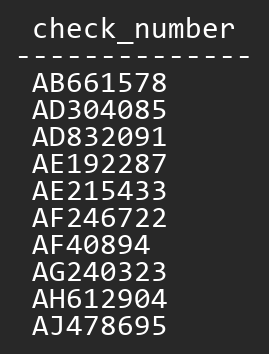</td>
</tr>
<tr>
<td colspan=2>
<details>
<summary>Click here to see the answer</summary>

```py
query = Payment.objects.all()
query = query.order_by('check_number')
query = query[0:10]
query = query.values('check_number')
df = DataFrame(data=query)
```
</details>
</td>
</tr>
</table>
    
<table border=1 width=100%>
<tr>
    <th align="left">EXERCISE 7</th>
    <th align="center">OUTPUT</th>
</tr>
<tr>
    <td>Display all the values for check_number in the payments table. Sort the results by check_number in descending order.</td>
    <td>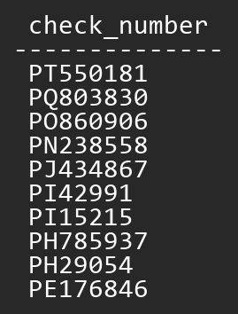</td>
</tr>
<tr>
<td colspan=2>
<details>
<summary>Click here to see the answer</summary>

```py
query = Payment.objects.all()
query = query.order_by('-check_number')
query = query[0:10]
query = query.values('check_number')
df = DataFrame(data=query)
```
</details>
</td>
</tr>
</table>
    
<table border=1 width=100%>
<tr>
    <th align="left">EXERCISE 8</th>
    <th align="center">OUTPUT</th>
</tr>
<tr>
    <td>Display all the values for payment_date in the payments table. Sort the results by payment_date.</td>
    <td>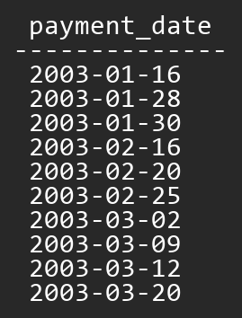</td>
</tr>
<tr>
<td colspan=2>
<details>
<summary>Click here to see the answer</summary>

```py
query = Payment.objects.all()
query = query.order_by('payment_date')
query = query[0:10]
query = query.values('payment_date')
df = DataFrame(data=query)
```
</details>
</td>
</tr>
</table>
    
<table border=1 width=100%>
<tr>
    <th align="left">EXERCISE 9</th>
    <th align="center">OUTPUT</th>
</tr>
<tr>
    <td>Display all the values for payment_date in the payments table. Sort the results by payment_date in descending order.</td>
    <td></td>
</tr>
<tr>
<td colspan=2>
<details>
<summary>Click here to see the answer</summary>

```py
query = Payment.objects.all()
query = query.order_by('-payment_date')
query = query[0:10]
query = query.values('payment_date')
df = DataFrame(data=query)
```
</details>
</td>
</tr>
</table>
    
<table border=1 width=100%>
<tr>
    <th align="left">EXERCISE 10</th>
    <th align="center">OUTPUT</th>
</tr>
<tr>
    <td>Display all the values for customer_number in the payments table. Sort the results by customer_number.</td>
    <td></td>
</tr>
<tr>
<td colspan=2>
<details>
<summary>Click here to see the answer</summary>

```py
from django.db.models import F

query = Payment.objects.all()
query = query.annotate(customer_number=F('customer__customer_number'))
query = query.order_by('customer_number')
query = query[0:10]
query = query.values('customer_number')
df = DataFrame(data=query)
```
</details>
</td>
</tr>
</table>
    
<table border=1 width=100%>
<tr>
    <th align="left">EXERCISE 11</th>
    <th align="center">OUTPUT</th>
</tr>
<tr>
    <td>Display all the values for customer_number in the payments table. Sort the results by customer_number in descending order.</td>
    <td></td>
</tr>
<tr>
<td colspan=2>
<details>
<summary>Click here to see the answer</summary>

```py
from django.db.models import F

query = Payment.objects.all()
query = query.annotate(customer_number=F('customer__customer_number'))
query = query.order_by('-customer_number')
query = query[0:10]
query = query.values('customer_number')
df = DataFrame(data=query)
```
</details>
</td>
</tr>
</table>
    
<table border=1 width=100%>
<tr>
    <th align="left">EXERCISE 12</th>
    <th align="center">OUTPUT</th>
</tr>
<tr>
    <td>Display the values for check_number and payment_date in the payments table.</td>
    <td>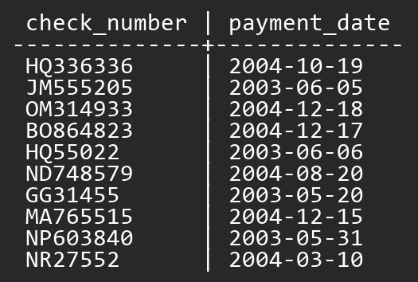</td>
</tr>
<tr>
<td colspan=2>
<details>
<summary>Click here to see the answer</summary>

```py
from django.db.models import F

query = Payment.objects.all()
# query = query.annotate(customer_number=F('check_number'))
query = query[0:10]
query = query.values('check_number', 'payment_date')
df = DataFrame(data=query)
```
</details>
</td>
</tr>
</table>
    
<table border=1 width=100%>
<tr>
    <th align="left">EXERCISE 13</th>
    <th align="center">OUTPUT</th>
</tr>
<tr>
    <td>Display the values for check_number and amount in the payments table. Display only the first</td>
    <td>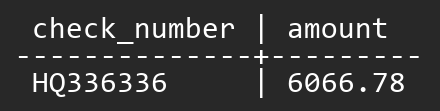</td>
</tr>
<tr>
<td colspan=2>
<details>
<summary>Click here to see the answer</summary>

```py
query = Payment.objects.all()
query = query.values('check_number', 'amount')
query = query[0:1]
df = DataFrame(data=query)
```
</details>
</td>
</tr>
</table>
    
<table border=1 width=100%>
<tr>
    <th align="left">EXERCISE 14</th>
    <th align="center">OUTPUT</th>
</tr>
<tr>
    <td>Display the values for check_number and customer_number in the payments table.</td>
    <td>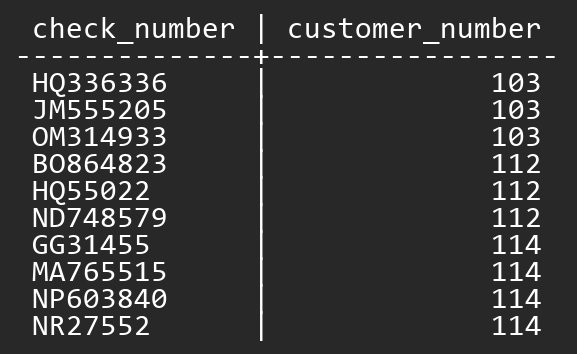</td>
</tr>
<tr>
<td colspan=2>
<details>
<summary>Click here to see the answer</summary>

```py
from django.db.models import F

query = Payment.objects.all()
query = query.annotate(
    customer_number=F('customer__customer_number')
)
query = query[0:10]
query = query.values('check_number', 'customer_number')
df = DataFrame(data=query)
```
</details>
</td>
</tr>
</table>
    
<table border=1 width=100%>
<tr>
    <th align="left">EXERCISE 15</th>
    <th align="center">OUTPUT</th>
</tr>
<tr>
    <td>Display a list of unique customer_number values in the payments table.</td>
    <td></td>
</tr>
<tr>
<td colspan=2>
<details>
<summary>Click here to see the answer</summary>

```py
from django.db.models import F

query = Payment.objects.all()
query = query.annotate(customer_number=F('customer__customer_number'))
query = query.values('customer_number')
query = query.distinct()
query = query[0:10]
df = DataFrame(data=query)
```
</details>
</td>
</tr>
</table>
    
<table border=1 width=100%>
<tr>
    <th align="left">EXERCISE 16</th>
    <th align="center">OUTPUT</th>
</tr>
<tr>
    <td>Display the smallest amount value in the payments table. Label the result 'Smallest Payment'.</td>
    <td></td>
</tr>
<tr>
<td colspan=2>
<details>
<summary>Click here to see the answer</summary>

```py
# Solution A
from django.db.models import F
query = Payment.objects.all()
query = query.annotate(smallest_payment=F('amount'))
query = query.order_by('amount')
query = query.values('smallest_payment')
query = query[0:1]
df = DataFrame(data=query)

# Solution B
from django.db.models import Min
query = Payment.objects.all()
result = query.aggregate(smallest_payment=Min('amount'))

result['smallest_payment'] = [result['smallest_payment']]
df = DataFrame(data=result)
```
</details>
</td>
</tr>
</table>
    
<table border=1 width=100%>
<tr>
    <th align="left">EXERCISE 17</th>
    <th align="center">OUTPUT</th>
</tr>
<tr>
    <td>Display the largest amount value in the payments table. Label the result "Largest Payment"</td>
    <td></td>
</tr>
<tr>
<td colspan=2>
<details>
<summary>Click here to see the answer</summary>

```py
# Solution A
from django.db.models import F
query = Payment.objects.all()
query = query.annotate(largest_payment=F('amount'))
query = query.order_by('-amount')
query = query.values('largest_payment')
query = query[0:1]
df = DataFrame(data=query)

# Solution B
from django.db.models import Max
query = Payment.objects.all()
result = query.aggregate(largest_payment=Max('amount'))

result['largest_payment'] = [result['largest_payment']]
df = DataFrame(data=result)
```
</details>
</td>
</tr>
</table>
    
<table border=1 width=100%>
<tr>
    <th align="left">EXERCISE 18</th>
    <th align="center">OUTPUT</th>
</tr>
<tr>
    <td>Display the average amount value in the payments table.</td>
    <td></td>
</tr>
<tr>
<td colspan=2>
<details>
<summary>Click here to see the answer</summary>

```py
from django.db.models import Avg
query = Payment.objects.all()
result = query.aggregate(amount_average=Avg('amount'))
result['amount_average'] = [result['amount_average']]

df = DataFrame(data=result)
```
</details>
</td>
</tr>
</table>
    
<table border=1 width=100%>
<tr>
    <th align="left">EXERCISE 19</th>
    <th align="center">OUTPUT</th>
</tr>
<tr>
    <td>Display the earliest payment_date value in the payments table.</td>
    <td>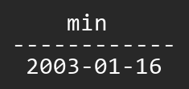</td>
</tr>
<tr>
<td colspan=2>
<details>
<summary>Click here to see the answer</summary>

```py
# Solution A
query = Payment.objects.all()
query = query.order_by('payment_date')
query = query.values('payment_date')
result = query.first()

# Solution B
from django.db.models import Min
query = Payment.objects.all()
result = query.aggregate(payment_date=Min('payment_date'))

result['payment_date'] = [result['payment_date']]
df = DataFrame(data=result)
```
</details>
</td>
</tr>
</table>
    
<table border=1 width=100%>
<tr>
    <th align="left">EXERCISE 20</th>
    <th align="center">OUTPUT</th>
</tr>
<tr>
    <td>Display the latest payment_date value in the payments table.</td>
    <td></td>
</tr>
<tr>
<td colspan=2>
<details>
<summary>Click here to see the answer</summary>

```py
# Solution A
query = Payment.objects.all()
query = query.order_by('-payment_date')
query = query.values('payment_date')
result = query.first()

# Solution B
from django.db.models import Max
query = Payment.objects.all()
result = query.aggregate(payment_date=Max('payment_date'))

result['payment_date'] = [result['payment_date']]
df = DataFrame(data=result)
```
</details>
</td>
</tr>
</table>
    
<table border=1 width=100%>
<tr>
    <th align="left">EXERCISE 21</th>
    <th align="center">OUTPUT</th>
</tr>
<tr>
    <td>Display the customer_number and the total payment amount assigned to that customer_number in the payments table. Display only the first 10 rows of results.</td>
    <td></td>
</tr>
<tr>
<td colspan=2>
<details>
<summary>Click here to see the answer</summary>

```py
from django.db.models import Sum, F
query = Payment.objects.all()
query = query.annotate(customer_number=F('customer__customer_number'))
query = query.values('customer_number')
query = query.annotate(total_amount=Sum('amount'))
query = query[0:10]

df = DataFrame(data=query)
```
</details>
</td>
</tr>
</table>
    
<table border=1 width=100%>
<tr>
    <th align="left">EXERCISE 22</th>
    <th align="center">OUTPUT</th>
</tr>
<tr>
    <td>Display the customer_number and the average payment amount assigned to that customer_number in the payments table.</td>
    <td></td>
</tr>
<tr>
<td colspan=2>
<details>
<summary>Click here to see the answer</summary>

```py
from django.db.models import Avg, F
query = Payment.objects.all()
query = query.annotate(customer_number=F('customer__customer_number'))
query = query.values('customer_number')
query = query.annotate(average_amount=Avg('amount'))
query = query[0:10]

df = DataFrame(data=query)
```
</details>
</td>
</tr>
</table>
    
<table border=1 width=100%>
<tr>
    <th align="left">EXERCISE 23</th>
    <th align="center">OUTPUT</th>
</tr>
<tr>
    <td>Calculate the number of rows in the payments table.</td>
    <td></td>
</tr>
<tr>
<td colspan=2>
<details>
<summary>Click here to see the answer</summary>

```py
from django.db.models import Count
query = Payment.objects.all()
# total_rows = query.count()
result = query.aggregate(total_rows=Count('*'))

result['total_rows'] = [result['total_rows']]
df = DataFrame(data=result)
```
</details>
</td>
</tr>
</table>
    
<table border=1 width=100%>
<tr>
    <th align="left">EXERCISE 24</th>
    <th align="center">OUTPUT</th>
</tr>
<tr>
    <td>Count the number of unique customer_number values in the payments table.</td>
    <td>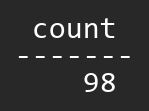</td>
</tr>
<tr>
<td colspan=2>
<details>
<summary>Click here to see the answer</summary>

```py
from django.db.models import Count, F

query = Payment.objects.all()
query = query.annotate(customer_number=F('customer__customer_number'))
query = query.values('customer_number')
query = query.distinct()
query = query.annotate(count=Count('customer_number'))
query = query[0:10]

df = DataFrame(data=query)
```
</details>
</td>
</tr>
</table>
    
<table border=1 width=100%>
<tr>
    <th align="left">EXERCISE 25</th>
    <th align="center">OUTPUT</th>
</tr>
<tr>
    <td>Display the customer_number values for those customer_numbers in the payments table that have values less than 200.</td>
    <td></td>
</tr>
<tr>
<td colspan=2>
<details>
<summary>Click here to see the answer</summary>

```py
from django.db.models import F

query = Payment.objects.annotate(
    customer_number=F('customer__customer_number'))
query = query.filter(customer_number__lt=200)
query = query.values('customer_number')
query = query[0:10]

df = DataFrame(data=query)
```
</details>
</td>
</tr>
</table>
    
<table border=1 width=100%>
<tr>
    <th align="left">EXERCISE 26</th>
    <th align="center">OUTPUT</th>
</tr>
<tr>
    <td>Display the customer_number values for those customer_numbers in the payments table that have values between 200 and 400.</td>
    <td>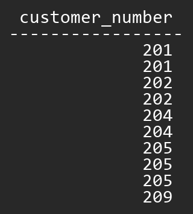</td>
</tr>
<tr>
<td colspan=2>
<details>
<summary>Click here to see the answer</summary>

```py
from django.db.models import F

query = Payment.objects.annotate(
    customer_number=F('customer__customer_number'))
query = query.filter(
    customer_number__gte=200,
    customer_number__lte=400
)
query = query.values('customer_number')
query = query[0:10]

df = DataFrame(data=query)
```
</details>
</td>
</tr>
</table>
    
<table border=1 width=100%>
<tr>
    <th align="left">EXERCISE 27</th>
    <th align="center">OUTPUT</th>
</tr>
<tr>
    <td>Display the customer_number values for those customer_numbers in the payments table that have values greater than 400.</td>
    <td></td>
</tr>
<tr>
<td colspan=2>
<details>
<summary>Click here to see the answer</summary>

```py
from django.db.models import F

query = Payment.objects.annotate(
    customer_number=F('customer__customer_number'))
query = query.filter(customer_number__gt=400)
query = query.values('customer_number')
query = query[0:10]

df = DataFrame(data=query)
```
</details>
</td>
</tr>
</table>
    
<table border=1 width=100%>
<tr>
    <th align="left">EXERCISE 28</th>
    <th align="center">OUTPUT</th>
</tr>
<tr>
    <td>Display the payment_date values for those records in the payments table in which the payment date is earlier than 12/31/2003.</td>
    <td></td>
</tr>
<tr>
<td colspan=2>
<details>
<summary>Click here to see the answer</summary>

```py
query = Payment.objects.filter(payment_date__lt='2003-12-31')
query = query.values('payment_date')
query = query[0:10]

df = DataFrame(data=query)
```
</details>
</td>
</tr>
</table>
    
<table border=1 width=100%>
<tr>
    <th align="left">EXERCISE 29</th>
    <th align="center">OUTPUT</th>
</tr>
<tr>
    <td>Display the payment_date values for those records in the payments table in which the payment date is between 12/31/2003 and 12/31/2004.</td>
    <td></td>
</tr>
<tr>
<td colspan=2>
<details>
<summary>Click here to see the answer</summary>

```py
query = Payment.objects.filter(
    payment_date__gte='2003-12-31',
    payment_date__lte='2004-12-31'
)
query = query.values('payment_date')
query = query[0:10]

df = DataFrame(data=query)
```
</details>
</td>
</tr>
</table>
    
<table border=1 width=100%>
<tr>
    <th align="left">EXERCISE 30</th>
    <th align="center">OUTPUT</th>
</tr>
<tr>
    <td>Display the payment_date values for those records in the payments table in which the payment date is 02/02/2005.</td>
    <td>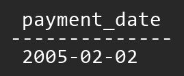</td>
</tr>
<tr>
<td colspan=2>
<details>
<summary>Click here to see the answer</summary>

```py
query = Payment.objects.filter(payment_date='2005-02-02')
query = query.values('payment_date')
query = query[0:10]

df = DataFrame(data=query)
```
</details>
</td>
</tr>
</table>
    
<table border=1 width=100%>
<tr>
    <th align="left">EXERCISE 31</th>
    <th align="center">OUTPUT</th>
</tr>
<tr>
    <td>Display the amount values for those records in the payments table in which the amount values is less than the average amount value in the payments table. Sort the results by payment amount from highest to lowest amount. Display only the first 10 rows of results.</td>
    <td></td>
</tr>
<tr>
<td colspan=2>
<details>
<summary>Click here to see the answer</summary>

```py
from django.db.models import Avg

result = Payment.objects.aggregate(average_amount=Avg('amount'))
average_amount = result['average_amount']

query = Payment.objects.filter(amount__lt=average_amount)
query = query.order_by('-amount')
query = query.values('amount')
query = query[0:10]

df = DataFrame(data=query)
```
</details>
</td>
</tr>
</table>
    
<table border=1 width=100%>
<tr>
    <th align="left">EXERCISE 32</th>
    <th align="center">OUTPUT</th>
</tr>
<tr>
    <td>Display the amount values for those records in the payments table in which the amount values is less than the average amount value in the payments table.</td>
    <td></td>
</tr>
<tr>
<td colspan=2>
<details>
<summary>Click here to see the answer</summary>

```py
from django.db.models import Avg

result = Payment.objects.aggregate(average_amount=Avg('amount'))
average_amount = result['average_amount']

query = Payment.objects.filter(amount__gt=average_amount)
query = query.values('amount')
query = query[0:10]

df = DataFrame(data=query)
```
</details>
</td>
</tr>
</table>
    
<table border=1 width=100%>
<tr>
    <th align="left">EXERCISE 33</th>
    <th align="center">OUTPUT</th>
</tr>
<tr>
    <td>Display the customer_name, payment_date, and amount from the payments and customers tables. Display only the first 10 rows of results.</td>
    <td>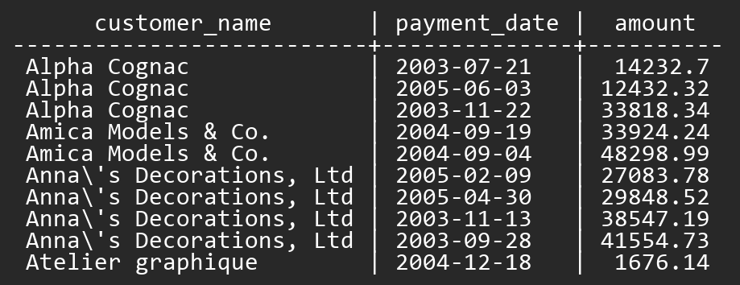</td>
</tr>
<tr>
<td colspan=2>
<details>
<summary>Click here to see the answer</summary>

```py
from django.db.models.functions import Lower
from django.db.models import F

query = Payment.objects.all()
query = query.annotate(customer_name=F('customer__customer_name'))

l_fields = ['customer_name', 'payment_date', 'amount']
query = query.values_list(*l_fields)
query = query.order_by(Lower('customer_name'))
query = query[0:10]

df = DataFrame(data=query, columns=l_fields)
```
</details>
</td>
</tr>
</table>
    
<table border=1 width=100%>
<tr>
    <th align="left">EXERCISE 34</th>
    <th align="center">OUTPUT</th>
</tr>
<tr>
    <td>Display the customer_name, phone and latest payment_date for each customer in the payments and customers tables. Label the latest payment_date column as Last Payment Date. Display only the first 10 rows of results.</td>
    <td>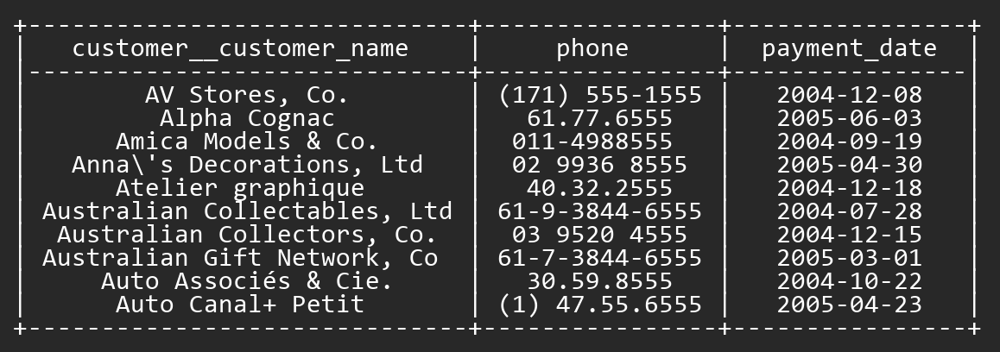</td>
</tr>
<tr>
<td colspan=2>
<details>
<summary>Click here to see the answer</summary>

```py
from django.db.models.functions import Lower
from django.db.models import Max

query = Payment.objects.all()
query = query.values('customer__customer_name')
query = query.annotate(
    phone=Max('customer__phone'),
    payment_date=Max('payment_date')
)
query = query.order_by(Lower('customer__customer_number'))
query = query[0:10]

df = DataFrame(data=query)
```
</details>
</td>
</tr>
</table>
    
<table border=1 width=100%>
<tr>
    <th align="left">EXERCISE 35</th>
    <th align="center">OUTPUT</th>
</tr>
<tr>
    <td>Display a list of country values in the customers table along with the number of customers in each country. The list should be in alphabetical order. Display only the first 10 rows of results.</td>
    <td></td>
</tr>
<tr>
<td colspan=2>
<details>
<summary>Click here to see the answer</summary>

```py
from django.db.models.functions import Lower
from django.db.models import Count

query = Customer.objects.all()
query = query.values('country')
query = query.annotate(count=Count('*'))
query = query.order_by(Lower('country'))
query = query[0:10]

df = DataFrame(data=query)
```
</details>
</td>
</tr>
</table>
    
<table border=1 width=100%>
<tr>
    <th align="left">EXERCISE 36</th>
    <th align="center">OUTPUT</th>
</tr>
<tr>
    <td>Display a list of country values in the customers table along with the number of payments for each country. Label the number of payments column 'payments'. The list should be in alphabetical order. Display only the first 10 rows of results.</td>
    <td></td>
</tr>
<tr>
<td colspan=2>
<details>
<summary>Click here to see the answer</summary>

```py
from django.db.models.functions import Lower
from django.db.models import Count, F

query = Payment.objects.all()
query = query.annotate(country=F('customer__country'))
query = query.values('country')
query = query.annotate(payments=Count('check_number'))
query = query.order_by(Lower('country'))
query = query[0:10]

df = DataFrame(data=query)
```
</details>
</td>
</tr>
</table>
    
<table border=1 width=100%>
<tr>
    <th align="left">EXERCISE 37</th>
    <th align="center">OUTPUT</th>
</tr>
<tr>
    <td>Display a list of order_number and order_date values from the orders table. Display only the first 10 rows of results.</td>
    <td>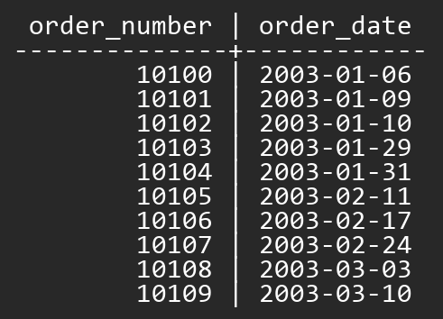</td>
</tr>
<tr>
<td colspan=2>
<details>
<summary>Click here to see the answer</summary>

```py
query = Order.objects.all()
query = query.values('order_number', 'order_date')
query = query[0:10]

df = DataFrame(data=query)
```
</details>
</td>
</tr>
</table>
    
<table border=1 width=100%>
<tr>
    <th align="left">EXERCISE 38</th>
    <th align="center">OUTPUT</th>
</tr>
<tr>
    <td>Display the customer_name, order_number, and order_date values from the customers and orders tables. Display only the first 10 rows of results.</td>
    <td></td>
</tr>
<tr>
<td colspan=2>
<details>
<summary>Click here to see the answer</summary>

```py
from django.db.models import F

query = Order.objects.all()
query = query.annotate(customer_name=F('customer__customer_name'))

l_fields = ['customer_name', 'order_number', 'order_date']
query = query.values_list(*l_fields)
query = query[0:10]

df = DataFrame(data=query, columns=l_fields)
```
</details>
</td>
</tr>
</table>
    
<table border=1 width=100%>
<tr>
    <th align="left">EXERCISE 39</th>
    <th align="center">OUTPUT</th>
</tr>
<tr>
    <td>Display the order_number, order_date, and value of each order from the orders and order_details tables. The value of each order is calculated by multiplying quantity_ordered by price_each. Label the calculated column "Order Value". Format the order value column so that only two digits are displayed after the decimal point. Display only the first ten results.</td>
    <td></td>
</tr>
<tr>
<td colspan=2>
<details>
<summary>Click here to see the answer</summary>

```py
from django.db.models import Sum, F

query = OrderDetail.objects.all()
query = query.annotate(order_number=F('order__order_number'))
query = query.values('order_number')
query = query.annotate(
    order_date=F('order__order_date'),
    order_value=Sum(F('quantity_ordered') * F('price_each'))
)
query = query[0:10]

df = DataFrame(data=query)
```
</details>
</td>
</tr>
</table>
    
<table border=1 width=100%>
<tr>
    <th align="left">EXERCISE 40</th>
    <th align="center">OUTPUT</th>
</tr>
<tr>
    <td>Display the customer_name, order_number, and value of each order from the orders and order_details tables. The value of each order is calculated by multiplying quantity_ordered by price_each. Label the calculated column "Order Value". Format the order value column so that only two digits are displayed after the decimal point. Display only the first ten results.</td>
    <td></td>
</tr>
<tr>
<td colspan=2>
<details>
<summary>Click here to see the answer</summary>

```py
from django.db.models import Sum, Max, F

query = OrderDetail.objects.all()
query = query.annotate(order_number=F('order__order_number'))
query = query.values('order_number')
query = query.annotate(
    customer_name=F('order__customer__customer_name'),
    order_value=Sum(F('quantity_ordered') * F('price_each'))
)

query = query[0:10]
l_fields = ['customer_name', 'order_number', 'order_value']
query = query.values_list(*l_fields)

df = DataFrame(data=query, columns=l_fields)
df.order_value = df.order_value.map('{:,.2f}'.format)
```
</details>
</td>
</tr>
</table>
    
<table border=1 width=100%>
<tr>
    <th align="left">EXERCISE 41</th>
    <th align="center">OUTPUT</th>
</tr>
<tr>
    <td>Display the customer_name, and value of all orders made by that customer. The value of each order is calculated by multiplying quantity_ordered by price_each. Label the calculated column "Value of All orders". Format the order value column so that only two digits are displayed after the decimal point. Display only the first ten results.</td>
    <td></td>
</tr>
<tr>
<td colspan=2>
<details>
<summary>Click here to see the answer</summary>

```py
from django.db.models import Sum, Max, F
from django.db.models.functions import Lower

query = OrderDetail.objects.all()
query = query.annotate(
    customer_number=F('order__customer__customer_number')
)
query = query.values('customer_number')
query = query.annotate(
    customer_name=F('order__customer__customer_name'),
    values_of_all_orders=Sum(F('quantity_ordered') * F('price_each'))
)
query = query[0:10]
query = query.values('customer_name', 'values_of_all_orders')

df = DataFrame(data=query)
df.values_of_all_orders = df.values_of_all_orders.map('{:,.2f}'.format)
```
</details>
</td>
</tr>
</table>
    
<table border=1 width=100%>
<tr>
    <th align="left">EXERCISE 42</th>
    <th align="center">OUTPUT</th>
</tr>
<tr>
    <td>Display the customer_number, order_number, and product_name values for each order using the orders, order_details, and products tables. Display only the first ten results.</td>
    <td></td>
</tr>
<tr>
<td colspan=2>
<details>
<summary>Click here to see the answer</summary>

```py
from django.db.models import F
query = OrderDetail.objects.all()
query = query.annotate(
    customer_number=F('order__customer__customer_number'),
    order_number=F('order__order_number'),
    product_name=F('product__product_name'),
)
query = query[0:10]
query = query.values('customer_number', 'order_number', 'product_name')

df = DataFrame(data=query)
```
</details>
</td>
</tr>
</table>
    
<table border=1 width=100%>
<tr>
    <th align="left">EXERCISE 43</th>
    <th align="center">OUTPUT</th>
</tr>
<tr>
    <td>Display the last_name of each Employee followed by the last_name of the Employee they report to. Display only the first ten results.</td>
    <td></td>
</tr>
<tr>
<td colspan=2>
<details>
<summary>Click here to see the answer</summary>

```py
query = Employee.objects.filter(reported_employee__isnull=False)
query = query.values('last_name', 'reported_employee__last_name')
query = query[0:10]

df = DataFrame(data=query)
```
</details>
</td>
</tr>
</table>
    
<table border=1 width=100%>
<tr>
    <th align="left">EXERCISE 44</th>
    <th align="center">OUTPUT</th>
</tr>
<tr>
    <td>Display the first_name and last_name of each manager followed by the first_name and last_name of each employee they supervise. Sort the results by the last_name of each manager. Display only the first ten results.</td>
    <td></td>
</tr>
<tr>
<td colspan=2>
<details>
<summary>Click here to see the answer</summary>

```py
from django.db.models import F

query = Employee.objects.filter(reported_employee__isnull=False)
query = query.annotate(
    manager_first_name=F('reported_employee__first_name'),
    manager_last_name=F('reported_employee__last_name')
)

l_fields = ['manager_first_name',
            'manager_last_name', 'first_name', 'last_name']
query = query.values_list(*l_fields)
query = query.order_by('manager_last_name')
query = query[0:10]

df = DataFrame(data=query, columns=l_fields)
```
</details>
</td>
</tr>
</table>
    